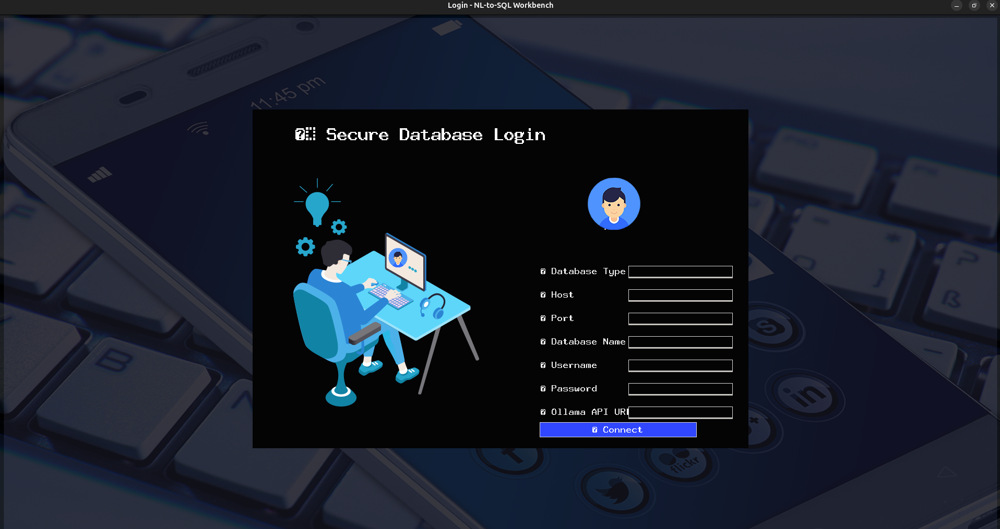
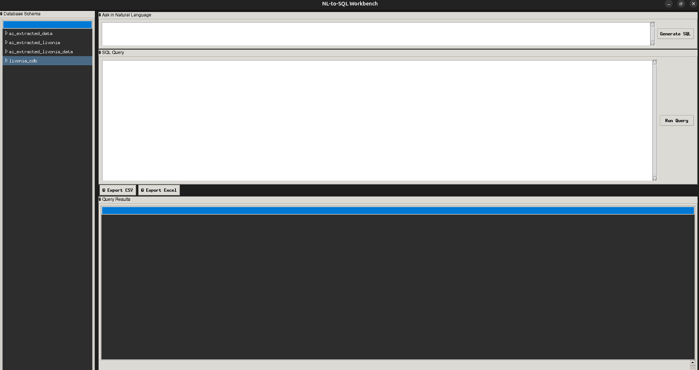

# AI Database Query System

This is a desktop application that allows users to run natural language queries against a connected SQL database, view results in a table with scrollbars, and edit values directly in the UI.

---

## 🚀 Features

- Run SQL queries or natural language queries against your database
- Scrollable result table (both X and Y)
- Inline editing with automatic database update
- UI inspired by MySQL Workbench
- Cross-platform (Linux, Windows, macOS)

---

## 📦 Requirements

Before you begin, make sure you have:

- **Python 3.11 – 3.14** installed ([Download here](https://www.python.org/downloads/))
- **Poetry** for dependency management ([Install instructions](https://python-poetry.org/docs/#installation))
- A running database (MySQL, PostgreSQL, SQLite, etc.)
- Connection credentials for your database

---

## 🔧 Installation

1. **Clone the repository**

   ```bash
   git clone https://github.com/yourusername/ai-database-query-system.git
   cd ai-database-query-system
   ```
2. **Install dependencies**

   ```bash
   poetry install
   ```
3. **(Optional) Install PyInstaller for building executables**

   ```bash
   poetry add pyinstaller
   ```

---

## ▶️ Running the Application

To start the app:

```bash
poetry run python main.py
```


## Screenshot




