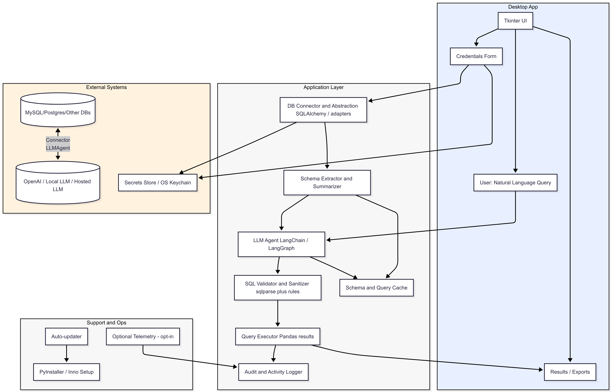

# NL-to-SQL Desktop Architecture

**Overview**

This document contains a high-level architecture diagram (component + data-flow) for the AI-powered desktop app that converts natural language to SQL across unknown databases. It also includes key components, data flows, security considerations, and deployment notes.

# Architcture Diagram

---

# Component Details

**1. Desktop UI (Tkinter)**

* Login / Connection wizard for DB credentials.
* Query box for natural language; options for read-only mode.
* Result grid (ttk.Treeview) + export buttons (CSV / Excel / JSON).
* Connection manager to store ephemeral session info only.

**2. DB Connector & Abstraction**

* Use `SQLAlchemy` where possible; fallback to native drivers: `pymysql`, `psycopg2`.
* Responsibilities: test connections, list databases/tables/columns, run queries safely.

**3. Schema Extractor & Summarizer**

* On first connect, fetch schema metadata and produce a compact summary (JSON).
* Compress long schemas (top N tables + sampled columns) to fit LLM context.
* Store ephemeral schema in cache for the session.

**4. LLM Agent (LangChain / LangGraph / Agno)**

* Receives: user NL question + compact schema + recent query context.
* Output: a single SQL statement and an optional `explain` block.
* Use prompt templates + system instructions to force output format (e.g., JSON with `sql` field).

**5. SQL Validator & Sanitizer**

* Parse SQL with `sqlparse` to enforce read-only rules by default.
* Block or require explicit user confirmation for `INSERT/UPDATE/DELETE/DROP`.
* Basic injection checks and timeouts.

**6. Query Executor**

* Run SQL in a transaction or read-only session; fetch results into `pandas.DataFrame`.
* If query touches multiple DBs, either run distributed queries (if allowed) or ask user to enable cross-db join support.

**7. Results UI & Export**

* Pretty-table display; pagination for large results.
* Export to CSV / Excel; copy-to-clipboard; show visual summary (counts, basic stats).

**8. Logging & Auditing**

* Keep an append-only action log (timestamp, user NL, final SQL, DB target, rows returned, execution time) stored locally in encrypted log file.

**9. Secrets & Security**

* Never store plaintext credentials. Use OS keychain (Windows Credential Manager, macOS Keychain, Linux Secret Service) or Fernet encryption with a user passphrase.
* Use TLS for DB connections where supported.
* Rate-limit LLM calls and sanitize prompts to avoid data leakage.

**10. Deployment & Packaging**

* Package as native desktop app using PyInstaller / Briefcase.
* Auto-update mechanism for bug fixes and LLM prompt patches.

# Data Flow (Short)

1. User enters DB credentials → Connector tests & extracts schema.
2. Schema summarized → Stored in cache & forwarded to LLM agent.
3. User asks a question → LLM returns SQL (structured response).
4. SQL → Validator → Executor → Results displayed & logged.
5. If SQL fails → error returned to LLM for iterative fix/rewrite.

# Extra Notes & Extensions

* **Multi-DB orchestration** : Let LLM pick DB by schema match; provide hints in prompt when multiple DBs available.
* **Follow-up queries** : Keep session memory for context-aware follow-ups (e.g., "only show those in Delhi").
* **RAG / Document support** : If user uploads SOPs or CSVs, use a retrieval step to include non-DB data.
* **Access control** : Allow read-only mode toggles; integrate with LDAP/AD for enterprise.

---

If you want, I can also generate a PNG of the diagram or produce a simplified one-page slide (PowerPoint).
